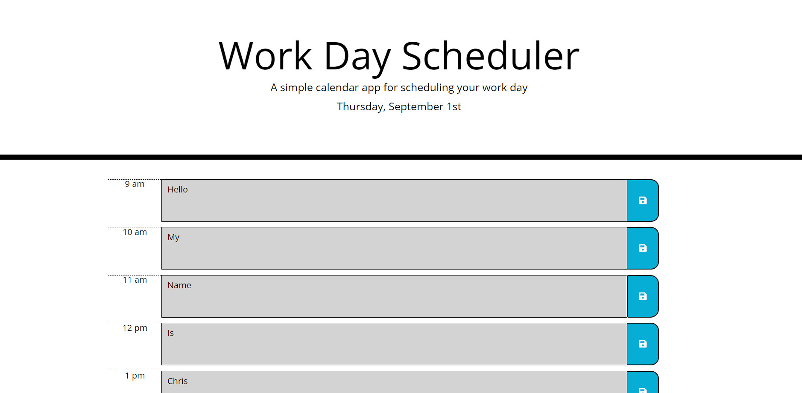

# work-scheduler

A small web app to keep your work day organized

If you ever find you lose track of time during the day and cant keep things scheduled. This work scheduler is the perfect webapp for you. It has the common workday hours on the side and shows you what hour it is, it also stores any inputs into the field to local storage just by clicking the save button on the right of each text entry.

URL: https://cwendland.github.io/work-scheduler/
